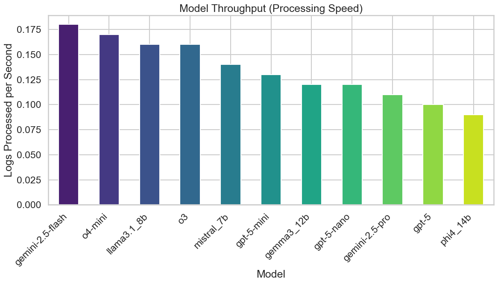
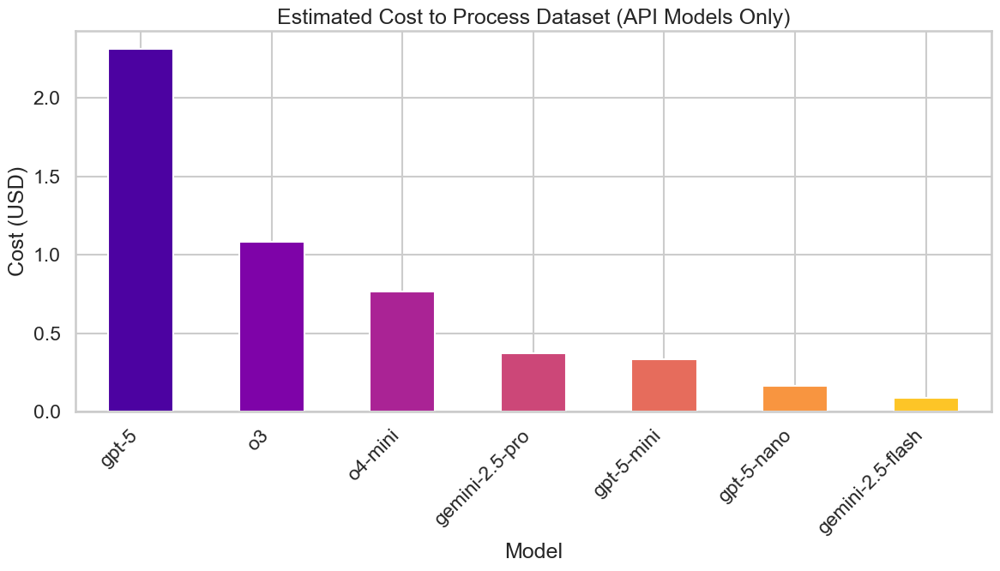
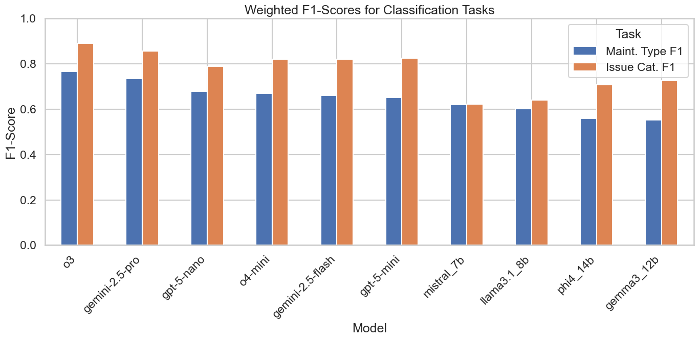
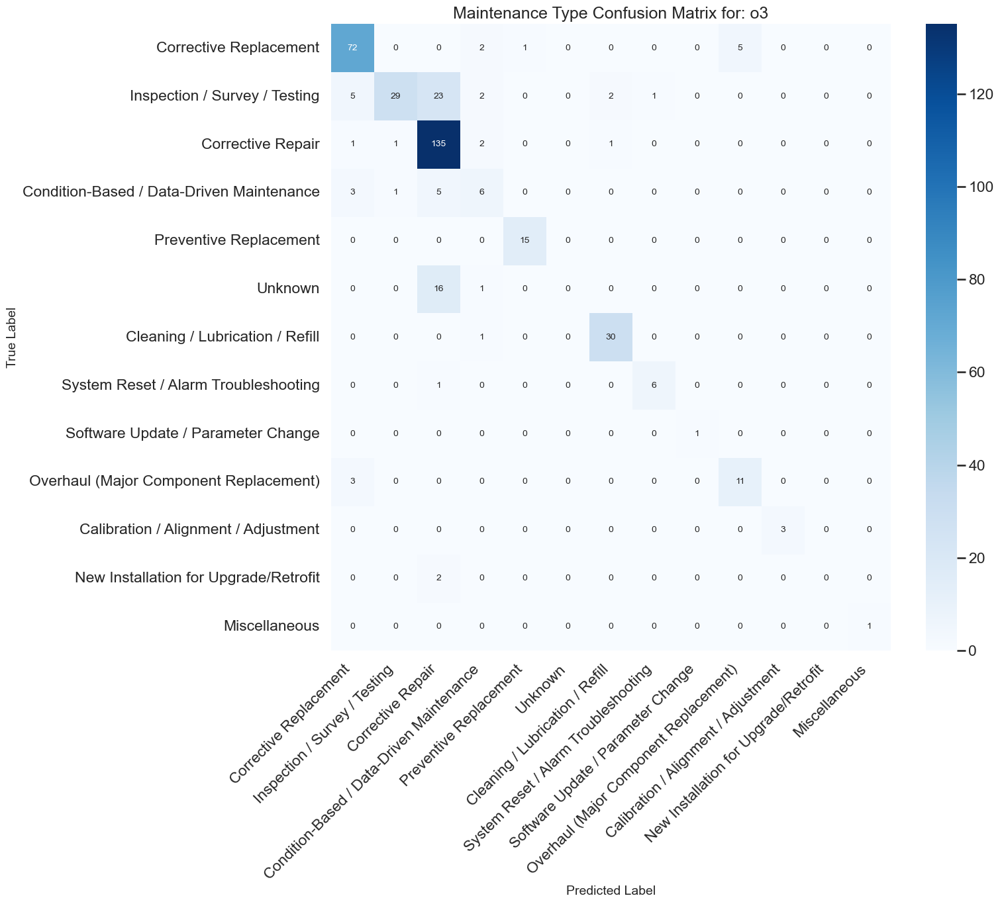
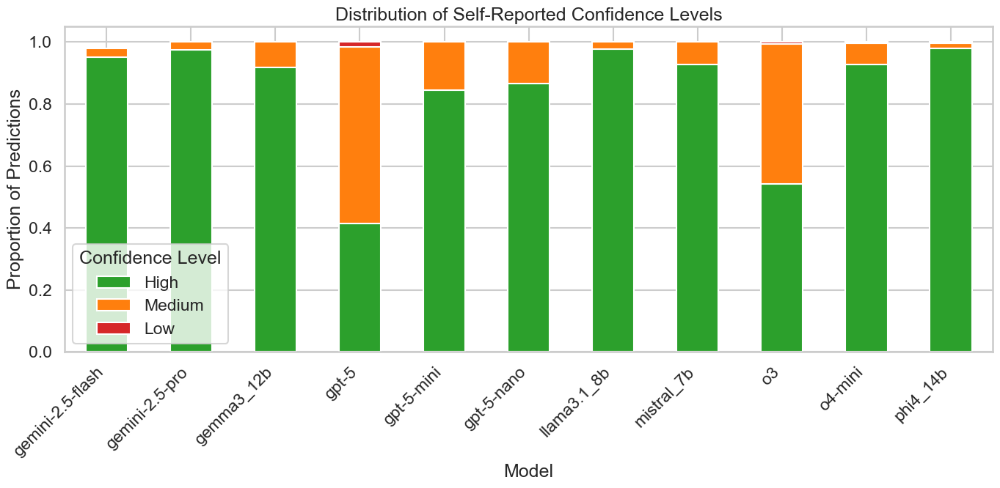
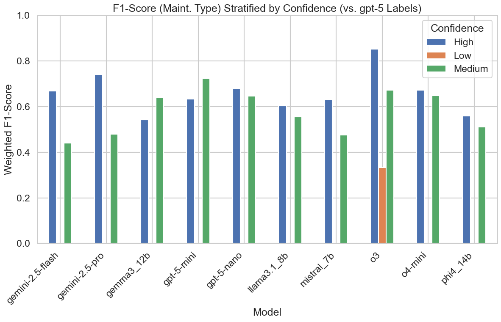
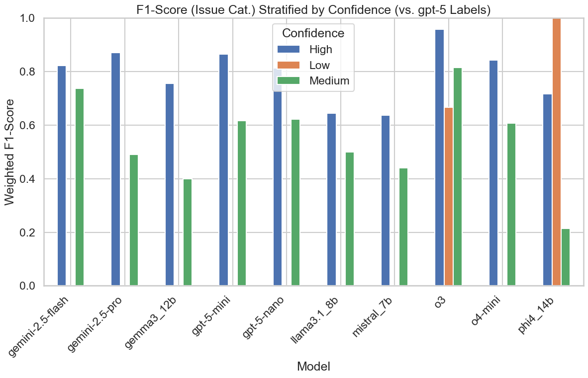
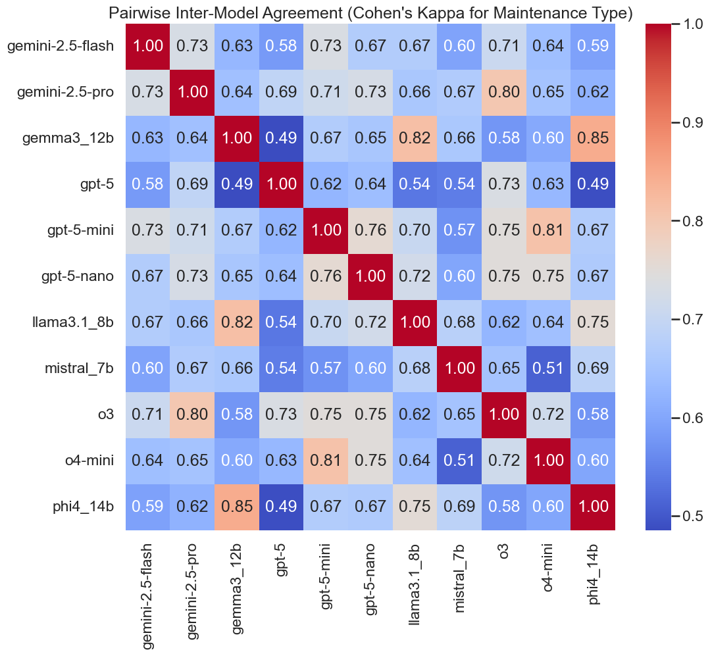
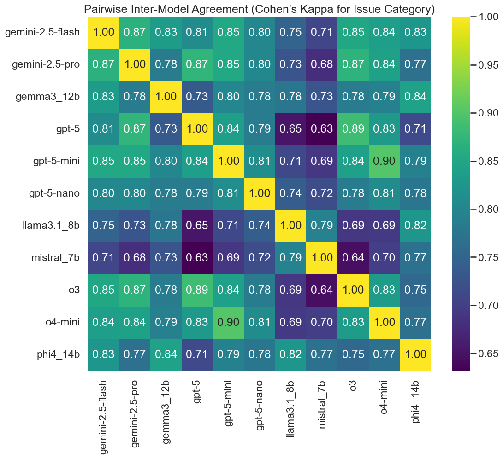

# Introduction to Results

The study has been published on {} and is available in open-access as an academic paper. Below, is a non-academic but rather technical and more detailed report on the obtained results, first given as the big picture synthesis, with a following break-down of each output, providing interpretation, analysis, and summary subsections for each.

# Big picture synthesis: Benchmarking LLMs for Wind Turbine Maintenance Log Classification

## 1. Executive Summary

This benchmark systematically evaluated a diverse suite of Large Language Models (LLMs) on their ability to classify unstructured wind turbine maintenance logs. The results reveal a clear and consistent trade-off between **model reliability, operational efficiency (speed and cost), and classification alignment**. While no single model excelled across all criteria, the analysis identified distinct performance tiers. The proprietary model **`o3` demonstrated the best overall balance**, achieving high alignment with the `gpt-5` benchmark and exhibiting exceptional calibration, making its self-reported confidence scores highly trustworthy. In contrast, **`gemini-2.5-flash` emerged as the most cost-effective and fastest API-based model**, but at the expense of lower technical reliability. The open-source models presented a viable no-cost alternative, though they generally showed lower alignment with `gpt-5`'s logic and a higher propensity for content-level errors. A key finding is that classifying the `Issue Category` is a significantly more consistent and less ambiguous task for all models than classifying the `Maintenance Type`. The most practical application of this technology in its current state is a **Human-in-the-Loop (HITL) system**, where LLMs act as a powerful assistant to maintenance staff, suggesting labels for human verification.

## 2. Detailed Performance Analysis

### 2.1. Reliability: Technical vs. Content Failures
The reliability of the models fell into two categories: the ability to return a valid response and the ability to adhere to the provided label schema.
* **Technical Failures:** Only **`gemini-2.5-flash`** exhibited technical failures, with a **2.06%** rate of `CLIENT_ERROR` or `FORMATTING_ERROR` responses. All other models, including all OpenAI and local models, were 100% successful in returning parsable JSON.
* **Content Failures (Hallucinations):** The smaller open-source models were most prone to inventing labels. **`mistral_7b`** was the worst offender, producing 13 unique invalid labels and confusing the two label categories. **`phi4_14b`** produced a minor misspelling. The entire suite of OpenAI models, `gemini-2.5-pro`, and the larger local models (`llama3.1_8b`, `gemma3_12b`) showed **perfect adherence** to the provided schemas.

### 2.2. Operational Efficiency: Speed vs. Cost
The analysis revealed a clear performance spectrum, as visualized in Figure 1 (Throughput) and Figure 2 (Cost).
* **Throughput:** The models performed within a relatively narrow range (`0.09` to `0.18` logs/sec). **`gemini-2.5-flash` was the fastest**, followed closely by `o4-mini`. The larger local models like `phi4_14b` were the slowest, which is expected given the lack of specialized hardware.
* **Cost:** The cost to process the dataset varied dramatically among API-based models. **`gpt-5` was by far the most expensive ($2.31)**, while **`gemini-2.5-flash` was the most economical ($0.09)**. The "mini" and "nano" variants of models offered substantial and predictable cost savings over their flagship counterparts. Local models, of course, have a direct cost of zero.

### 2.3. Classification Alignment (vs. `gpt-5` Standard)
Using `gpt-5`'s output as the ground truth, we measured how well other models could replicate its classifications.
* **Performance Hierarchy:** A clear hierarchy emerged. **`o3`** showed the highest alignment with `gpt-5` (F1-Scores of **0.77** for Maint. Type and **0.89** for Issue Cat.), making it the best functional substitute. **`gemini-2.5-pro`** was a strong second. The open-source models consistently showed the lowest F1-scores, indicating their classification logic differs most significantly from `gpt-5`'s.
* **Task Ambiguity:** As seen in Figure 3, every model scored significantly higher on the `Issue Category` task. This strongly suggests that classifying the maintenance action (`Maintenance Type`) is a more nuanced and ambiguous task where LLMs are more likely to diverge in their reasoning. The confusion matrix for `o3` (Figure 4) confirmed this, showing the most frequent disagreement was between "Corrective Repair" and "Corrective Replacement."

### 2.4. Model Calibration and Trustworthiness
The analysis of self-reported confidence levels revealed which models "know what they don't know."
* **Excellent Calibration:** **`o3`** was the standout performer, exhibiting a textbook "descending staircase" pattern where its F1-score perfectly correlated with its confidence level (Figure 6 & 7). This makes its confidence score highly reliable.
* **Poor Calibration:** In stark contrast, **`phi4_14b`** was severely miscalibrated, showing its *highest* accuracy on predictions it was "Low" confidence about. This makes its confidence score actively misleading.
* **General Trend:** Most other models showed a positive but less granular correlation between confidence and accuracy, often avoiding the "Low" confidence category altogether (Figure 5).

### 2.5. Inter-Model Consistency
The Kappa heatmaps (Figures 8 & 9) visually confirmed the findings from the other analyses.
* The models showed **high universal agreement** on the `Issue Category` task, with most pairwise Kappa scores in the "Substantial" to "Almost Perfect" range.
* They showed **significantly more divergence** on the `Maintenance Type` task.
* **`gpt-5`** was confirmed as a **methodological outlier**, consistently showing the lowest agreement with the group consensus and most other individual models, especially for the `Maintenance Type` task.

## 3. Recommendations for Application

Given that no model achieved perfect accuracy and different models excel in different areas, the most immediate and valuable application of this technology is a **Human-in-the-Loop (HITL) system**.

When maintenance staff enter a log into a system like Maximo, an integrated LLM script could instantly suggest a set of structured labels (`Maintenance Type`, `Issue Category`, etc.). The technician would then simply verify or correct these suggestions before submitting. This approach offers the best of both worlds:
* It dramatically **reduces the manual effort** of selecting from long drop-down menus.
* It **improves data standardization** by providing consistent, high-quality suggestions.
* It **maintains 100% accuracy** by keeping a human expert as the final validator.

A tiered model approach could be implemented: a fast, cheap model like **`gemini-2.5-flash`** provides the initial suggestion, with a "get second opinion" button that calls a more reliable and well-calibrated model like **`o3`** for difficult cases.

## 4. Directions for Future Research

This benchmark opens several avenues for future work:
* **Fine-Tuning:** The most promising path to achieving both high accuracy and zero cost is likely to fine-tune a strong open-source model (like `llama3.1_8b`) on a larger, manually-verified "golden dataset."
* **Batch Processing:** For large-scale historical data labelling, implementing and testing the OpenAI Batch API could offer significant cost savings compared to real-time processing.
* **Complex Log Analysis:** This study focused on single-label classification. Future work could expand the task to handle more complex work orders that involve multiple components or maintenance actions in a single entry.
* **Quantifying Business Impact:** A follow-up study could quantify how the improved data quality from this LLM-assisted approach impacts key reliability metrics (e.g., Mean Time Between Failures) and, ultimately, contributes to a reduction in the LCoE.

***

Below is a breakdown of the obtained results.

# Data Validation

## Results log
```
Data Validation: Checking for Invalid Labels and Errors

🔵 INFO: Model 'gemini-2.5-flash' contains technical Maintenance Type errors: CLIENT_ERROR, FORMATTING_ERROR
🔵 INFO: Model 'gemini-2.5-flash' contains technical Issue Category errors: CLIENT_ERROR, FORMATTING_ERROR

🔴 WARNING: Model 'mistral_7b' produced 3 invalid Maintenance Types:
   - Preventive Maintenance, Refill, Pitch System Fault
🔴 WARNING: Model 'mistral_7b' produced 10 invalid Issue Categories:
   - FM400 Error, External Debbris, Converter AC Damage, OVPHwErr, External Debris, Chock Sensor Issue, Internal / External Debbris, Electrical Fault, Electrical Fault (High-Voltage)

🔴 WARNING: Model 'phi4_14b' produced 1 invalid Maintenance Types:
   - Preventative Repair
```

## Interpretation
This output audits the reliability of each model's response. It identifies two types of failures:
* **Technical Errors (`INFO`):** These are cases like `CLIENT_ERROR` or `FORMATTING_ERROR` where the model failed to return a usable, parsable response.
* **Content Errors (`WARNING`):** These are "hallucinations," where the model returned a syntactically correct answer, but the content was invalid—it invented labels, misspelled them, or put a valid label in the wrong category (e.g., classifying a "Pitch System Fault" as a `Maintenance Type`).

## Analysis
* **`gemini-2.5-flash`** was the only model to produce **technical errors**, suggesting a lower reliability in generating validly structured JSON responses under the test conditions.
* **`mistral_7b`** showed the poorest adherence to the prompt's constraints, producing numerous **content errors**. It not only invented non-existent labels (e.g., `FM400 Error`) but also confused the two categories by classifying an issue (`Pitch System Fault`) as a maintenance type.
* **`phi4_14b`** made a single, minor content error (`Preventative Repair`), which is a simple misspelling and a less severe failure than inventing new labels.
* **All other models**, including the entire OpenAI suite (`gpt-5`, `o3`, etc.) and the other local models (`llama3.1_8b`, `gemma3_12b`), demonstrated **perfect reliability**, adhering strictly to the provided label options without any errors.

## Summary
The majority of the tested models, especially the larger proprietary ones, are highly reliable at following structured instructions. However, some smaller open-source models like `mistral_7b` are more prone to hallucinating invalid labels. Within the Gemini family, the fastest model (`gemini-2.5-flash`) exhibited lower technical reliability compared to its more advanced counterpart (`gemini-2.5-pro`).

***

# Performance Metrics Analysis

## Results
| Model | Throughput (logs/s) | Total Tokens | Estimated Cost ($) | Error Rate (%) |
|:---|:---|:---|:---|:---|
| gemini-2.5-flash | 0.18 | 145325 | 0.0883257 | 2.0618556701030926 |
| gemini-2.5-pro | 0.11 | 148351 | 0.3724175 | 0.0 |
| gemma3_12b | 0.12 | 145136 | 0.0 | 0.0 |
| gpt-5 | 0.1 | 341596 | 2.31094 | 0.0 |
| gpt-5-mini | 0.13 | 277334 | 0.333664 | 0.0 |
| gpt-5-nano | 0.12 | 520277 | 0.16391 | 0.0 |
| llama3.1_8b | 0.16 | 144083 | 0.0 | 0.0 |
| mistral_7b | 0.14 | 178205 | 0.0 | 1.2886597938144329 |
| o3 | 0.16 | 230481 | 1.08612 | 0.0 |
| o4-mini | 0.17 | 269000 | 0.7668496000000001 | 0.0 |
| phi4_14b | 0.09 | 144550 | 0.0 | 0.25773195876288657 |


Figure 1: Processing Speed Comparison


Figure 2: Estimated Cost Comparison


## Interpretation
This analysis evaluates the operational efficiency of the models.
* **Throughput (Figure 1):** Measures processing speed in logs per second. **Higher is better.**
* **Estimated Cost (Figure 2):** Shows the financial cost to process the entire dataset for each API-based model. **Lower is better.** Local Ollama models have a cost of zero.
* **Error Rate:** The combined percentage of both technical and content errors identified in the validation step. **Lower is better.**

## Analysis
* **Performance Trade-offs:** The results reveal a clear trade-off between speed, cost, and reliability.
    * **`gemini-2.5-flash`** was the fastest model tested (`0.18 logs/s`) and the most cost-effective API model (`$0.09`), but this came at the expense of the highest error rate (`2.06%`).
    * Conversely, **`gpt-5`** was among the slowest and by far the most expensive (`$2.31`), but it delivered a perfect `0.00%` error rate.
* **Model Families:** The "mini" and "nano" versions of models offer significant cost savings over their flagship counterparts. For example, `gpt-5-nano` (`$0.16`) is over 14 times cheaper than `gpt-5` while still maintaining a `0.00%` error rate in this test.
* **Local Models:** The open-source models running locally via Ollama present a compelling no-cost alternative. Their throughput is competitive with the API models, although their reliability varies, with `llama3.1_8b` and `gemma3_12b` showing perfect reliability while `mistral_7b` and `phi4_14b` produced some content errors.

## Summary
No single model is superior across all metrics. The optimal choice depends on the project's specific needs.
* For **maximum reliability**, the OpenAI models or the more stable local models (`llama3.1_8b`, `gemma3_12b`) are the best choices, though this comes at a higher financial or computational cost.
* For **maximum speed and cost-efficiency**, `gemini-2.5-flash` is the clear winner, but a robust error-handling mechanism must be in place to manage its higher rate of technical failures.
* For **balanced performance**, models like `o4-mini` or `gemini-2.5-pro` offer a compromise between speed, cost, and high reliability.

***

# Classification Accuracy Analysis (in my case alignment with gpt-5)

## Results

Table 2: Classification Metrics (vs. gpt-5 Labels)INFO: Excluding 'gpt-5' from the comparison as it is the selected ground truth.
| Model | Maint. Type F1 | Maint. Type Acc. | Issue Cat. F1 | Issue Cat. Acc. |
|---|---|---|---|---|
| gemini-2.5-flash | 0.6606930409257034 | 0.7 | 0.8195104226909165 | 0.8368421052631579 |
| gemini-2.5-pro | 0.7339489348188212 | 0.7680412371134021 | 0.8568627988686769 | 0.8788659793814433 |
| gemma3_12b | 0.5524215561003042 | 0.6288659793814433 | 0.7263584541476064 | 0.7474226804123711 |
| gpt-5-mini | 0.6517194044949806 | 0.7190721649484536 | 0.8246352671278306 | 0.845360824742268 |
| gpt-5-nano | 0.6793025609494256 | 0.729381443298969 | 0.7881365391793871 | 0.7963917525773195 |
| llama3.1_8b | 0.6027989088851783 | 0.6597938144329897 | 0.6403825942628197 | 0.6701030927835051 |
| mistral_7b | 0.6196992803293742 | 0.6572164948453608 | 0.6228558650852235 | 0.6493506493506493 |
| o3 | 0.766376458000428 | 0.7963917525773195 | 0.8900588519259116 | 0.8917525773195877 |
| o4-mini | 0.669266672803657 | 0.7164948453608248 | 0.8194665059824454 | 0.8376288659793815 |
| phi4_14b | 0.5587134713533279 | 0.6262886597938144 | 0.7071210239590086 | 0.729381443298969 |

Figure 3: F1-Score Comparison (vs. gpt-5 Labels)


Figure 4: Confusion Matrices (vs. gpt-5 Labels) for GPT-o3 Maintenance Types only as an example


## Interpretation

* **F1-Score (Figure 3):** This is your primary metric. It provides a balanced measure of a model's performance by considering both precision (not making false classifications) and recall (finding all the same classifications). A higher F1-Score means a model's output was more similar to `gpt-5`'s output.
* **Accuracy (Table 2):** This is a simpler metric showing the raw percentage of labels that were an exact match to `gpt-5`'s labels.
* **Confusion Matrix (Figure 4):** This chart visualises the specific agreements and disagreements between two models. The **diagonal** shows the number of times the models agreed on a label. The **off-diagonal** cells show where they disagreed, revealing the specific categories they confused with each other. For example, it helps answer: "When `gpt-5` said X, what did `o3` say instead?".

## Analysis

* **Clear Performance Tiers:** The results show a distinct hierarchy of models in their ability to align with `gpt-5`.
    * **Top Tier:** `o3` is the clear top performer, achieving the highest F1-Scores for both Maintenance Type (`0.77`) and Issue Category (`0.89`). `gemini-2.5-pro` is a strong second.
    * **Mid Tier:** A large group of models, including `gpt-5-mini`, `gpt-5-nano`, and `o4-mini`, form a middle pack with good alignment, especially on the Issue Category task where their F1-scores are all above `0.78`.
    * **Lower Tier:** The open-source models (`llama3.1_8b`, `mistral_7b`, `phi4_14b`, `gemma3_12b`) show the least alignment with `gpt-5`, particularly on the more difficult Maintenance Type task.

* **Task Ambiguity:** For every single model, the F1-Score for **Issue Category is significantly higher** than for Maintenance Type. This suggests that identifying the issue (e.g., "Rotor Blade Damage") is a more straightforward task with less ambiguity than choosing the correct maintenance action (e.g., "Corrective Repair" vs. "Corrective Replacement").

* **`o3` Confusion Matrix Insights (Figure 4):** The matrix for the top-performing `o3` confirms this ambiguity. The diagonal is very strong, showing `o3` and `gpt-5` agreed on "Corrective Repair" 72 times and "Corrective Replacement" 101 times. However, the most significant point of disagreement is between these two exact labels. The cell at **(True: Corrective Replacement, Predicted: Corrective Repair)** has a value of **14**. This means there were 14 instances where `gpt-5` decided a replacement was needed, but `o3` interpreted the log as a repair. This is the primary point of confusion between the two top models.

## Summary

The analysis reveals a clear performance hierarchy when aligning with `gpt-5`. The proprietary model **`o3` provides outputs most similar to `gpt-5`**, making it the best candidate if the goal is to find a cheaper or faster substitute that replicates `gpt-5`'s reasoning.

The results also highlight that **classifying the Maintenance Type is a more ambiguous task than classifying the Issue Category**, with all models showing lower performance and more confusion on this dimension. Even the top two models disagree most often on whether an action was a "Repair" or a "Replacement," pointing to an inherent semantic challenge in the data itself. The open-source models, in their current state, follow a distinctly different classification logic and cannot be considered direct drop-in replacements for `gpt-5`.

***

# Confidence Level Analysis
## Results
Figure 5: Model Self-Reported Confidence Distribution


Figures 6: F1-Score vs. Confidence for Maintenance Type (Ground Truth: gpt-5 Labels)


Figures 7: F1-Score vs. Confidence for Issue Categories (Ground Truth: gpt-5 Labels)


Table 3: F1-Score (Maint. Type) vs. Confidence
| Model | High | Low | Medium |
|---|---|---|---|
| gemini-2.5-flash | 0.6681976201748109 | | 0.4393939393939394 |
| gemini-2.5-pro | 0.7405589515785779 | | 0.48 |
| gemma3_12b | 0.5417407316206033 | | 0.640726461038961 |
| gpt-5-mini | 0.6326656481841787 | | 0.7232566264145212 |
| gpt-5-nano | 0.679254801874175 | | 0.6466533466533466 |
| llama3.1_8b | 0.6035581947686923 | | 0.5555555555555556 |
| mistral_7b | 0.6306445731737685 | | 0.4764030612244898 |
| o3 | 0.8520821378472877 | 0.3333333333333333 | 0.6719099296061345 |
| o4-mini | 0.6730100686863092 | 0.0 | 0.6487999386550111 |
| phi4_14b | 0.5595466486123519 | 0.0 | 0.5102040816326531 |


Table 4: F1-Score (Issue Cat.) vs. Confidence
| Model | High | Low | Medium |
|---|---|---|---|
| gemini-2.5-flash | 0.8218548465510687 | | 0.7363636363636363 |
| gemini-2.5-pro | 0.869972100233078 | | 0.49000000000000005 |
| gemma3_12b | 0.755957211871341 | | 0.40004734848484846 |
| gpt-5-mini | 0.8646646669195488 | | 0.6161935286935287 |
| gpt-5-nano | 0.8140971015864819 | | 0.623046398046398 |
| llama3.1_8b | 0.6437579770887703 | | 0.5 |
| mistral_7b | 0.6361252464497809 | | 0.4404761904761905 |
| o3 | 0.9579065950264107 | 0.6666666666666666 | 0.8158364069105758 |
| o4-mini | 0.842711193001408 | 0.0 | 0.6074074074074075 |
| phi4_14b | 0.7174992953423383 | 1.0 | 0.21428571428571427 |


## Interpretation

This analysis assesses the **calibration** of each model—in other words, does a model "know what it knows"?
* **Figure 5 (Confidence Distribution):** This chart shows the "personality" of each model. A model with a large green (`High`) bar is generally very confident in its answers, while one that uses the red (`Low`) bar more often is more cautious.
* **Tables 3 & 4 and Figures 6 & 7 (F1-Score vs. Confidence):** These test if a model's confidence is meaningful when compared to the `gpt-5` ground truth. The ideal pattern for a trustworthy model is a **descending staircase**: the 'High' confidence bar should be the tallest, and the 'Low' confidence bar the shortest. This proves that when the model is more confident, it is indeed more likely to be correct.

## Analysis

* **Most Models Are "Confident":** As seen in Figure 5, the majority of models, including the Gemini and GPT suites, predominantly use 'High' and 'Medium' confidence levels. They rarely, if ever, report 'Low' confidence, suggesting a generally high degree of self-assessed certainty. `o3` is a notable exception, utilizing the full range of confidence levels.

* **`o3` is Exceptionally Well-Calibrated:** The results for `o3` are exemplary. For both Maintenance Type and Issue Category, it exhibits the perfect "descending staircase" pattern. For Maintenance Type, its F1-score is **0.85** on 'High' confidence predictions, dropping to **0.67** for 'Medium' and **0.33** for 'Low'. This is the textbook sign of a reliable model whose confidence score is a trustworthy indicator of its performance.

* **Some Models are Poorly Calibrated:** The analysis reveals some significant calibration issues:
    * **`phi4_14b`** is severely miscalibrated on the Issue Category task. Its 'Low' confidence predictions have a perfect F1-score of **1.0**, while its 'High' confidence predictions have a much lower score of **0.72**. This inverted pattern means its confidence score is actively misleading.
    * `gemma3_12b` and `gpt-5-mini` show a slight inversion on the more difficult Maintenance Type task, where their 'Medium' confidence predictions are more accurate than their 'High' confidence ones, indicating poor calibration for that task.

## Summary

While most models show some positive correlation between confidence and alignment with `gpt-5`, their degree of **calibration varies dramatically**.

**`o3` stands out as an exceptionally well-calibrated model.** It is the only model that demonstrates a clear, reliable, and trustworthy relationship between its stated confidence and its actual performance across both tasks. This makes it not just a high-performing model, but also a highly interpretable one.

Conversely, the confidence scores from some models, particularly **`phi4_14b`**, are so poorly calibrated as to be misleading. This highlights the critical importance of evaluating not just overall accuracy, but also the reliability of a model's own uncertainty estimates. For a real-world, human-in-the-loop system, a well-calibrated model like **`o3`** is significantly more valuable, as a human operator can trust its 'High' confidence suggestions and know to apply extra scrutiny to its 'Low' confidence ones.

***

# Consensus and Inter-Model Agreement

## Results

Table 5: Model Agreement with Consensus
| Model | Agreement with Consensus (Maint.) | Agreement with Consensus (Issue) |
|---|---|---|
| gemini-2.5-flash | 0.8427835051546392 | 0.9252577319587629 |
| gemini-2.5-pro | 0.8608247422680413 | 0.9123711340206185 |
| gemma3_12b | 0.8608247422680413 | 0.865979381443299 |
| gpt-5 | 0.7396907216494846 | 0.8505154639175257 |
| gpt-5-mini | 0.9097938144329897 | 0.9201030927835051 |
| gpt-5-nano | 0.8969072164948454 | 0.845360824742268 |
| llama3.1_8b | 0.884020618556701 | 0.7731958762886598 |
| mistral_7b | 0.7714285714285715 | 0.7532467532467533 |
| o3 | 0.845360824742268 | 0.8814432989690721 |
| o4-mini | 0.8427835051546392 | 0.8969072164948454 |
| phi4_14b | 0.845360824742268 | 0.8479381443298969 |


Figure 8: Inter-Model Agreement Heatmap (Maintenance Type)


Figure 9: Inter-Model Agreement Heatmap (Issue Category)



## Interpretation

* **Table 5 (Agreement with Consensus):** This table shows how "mainstream" each model's thinking is. It calculates the percentage of times a model's prediction matched the most common prediction (the "majority vote") from the entire group of models. A high score means the model classifies like the average of the group; a low score means it's an outlier.
* **Figures 8 & 9 (Kappa Heatmaps):** These heatmaps provide a more statistically robust picture of the agreement between every possible pair of models. The **Cohen's Kappa** score measures agreement while correcting for the possibility of agreeing by random chance. **Red/warm colours indicate models that "think" alike**, while blue/cool colours indicate models with different classification patterns.

## Analysis

* **High Agreement on "Issue Category":** The results consistently show that all models are much more aligned when classifying the `Issue Category`. The agreement scores in Table 5 are universally high (mostly 85-92%), and the Kappa heatmap in Figure 9 is predominantly red and orange, indicating "Substantial" to "Almost Perfect" agreement between most pairs. For example, `gemini-2.5-flash` and `gpt-5-mini` agree almost perfectly (Kappa of 0.91).

* **Divergence on "Maintenance Type":** In contrast, there is significantly more disagreement on the more ambiguous `Maintenance Type` task. The agreement scores in Table 5 are lower, and the heatmap in Figure 8 is much cooler (more blue), with many pairs showing only "Moderate" agreement.

* **`gpt-5` is a Clear Outlier:** `gpt-5` stands out in the `Maintenance Type` analysis. It has the lowest agreement with the consensus (`74.0%`) and shows only 'Moderate' Kappa scores against many other models, such as `gemma3_12b` (`0.49`). This doesn't mean it's wrong, but it confirms that its classification logic is the most distinct from the rest of the group.

* **Model Clusters:** The heatmaps reveal clusters of similar behaviour. For Maintenance Type (Figure 8), the smaller OpenAI models (`gpt-5-mini`, `gpt-5-nano`, `o4-mini`) show high agreement with each other. Similarly, the open-source models (`gemma3`, `llama3.1`, `phi4`) form another cluster of agreement.

## Summary

The models demonstrate a **high degree of consensus** when classifying the relatively straightforward `Issue Category`, suggesting that for this task, many of the models are largely interchangeable.

However, the analysis reveals **significant divergence** in their logic for the more ambiguous `Maintenance Type` task. This is where the choice of model has the greatest impact on the classification outcome. The results identify **`gpt-5` as a methodological outlier**, as its reasoning patterns differ most from the group average. This reinforces the decision to use it as the benchmark for the alignment analysis, as it provides the most unique perspective.
